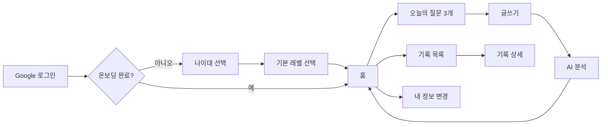
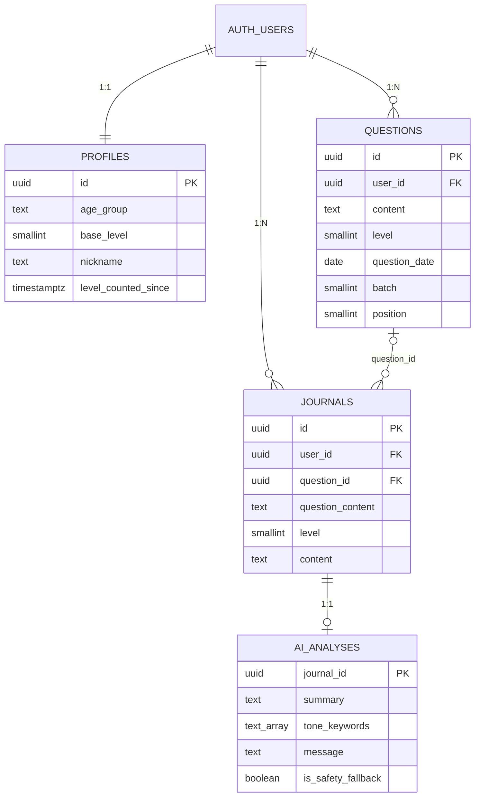

# 끄적끄적 (dear-mind)

> 매일 하나의 질문으로 나를 들여다보는, AI와 함께하는 자기성찰 기록 서비스

🔗 **서비스 바로가기: [dear-mind-phi.vercel.app](https://dear-mind-phi.vercel.app)**

AI 상담 서비스가 아니라 **스스로 기록하고 돌아보는 경험**에 집중한 개인 프로젝트입니다.
매일 나에게 맞는 깊이의 질문 3개를 받고, 그중 하나에 답을 쓰면 AI가 글을 요약하고 감정 키워드와 짧은 메시지를 남겨줍니다.

- 파스텔 레트로 데스크탑(Windows) 감성의 UI — 모든 화면을 `.EXE` 스타일의 창 프레임으로 구성
- 질문의 깊이를 Lv.1(가볍게) ~ Lv.4(아주 깊게)로 나누고, 색(하늘색 → 라벤더 → 핑크 → 진보라)으로 표현

<br />

## 기술 스택

| 구분      | 사용 기술                                                        |
| --------- | ---------------------------------------------------------------- |
| Frontend  | Next.js 16 (App Router), React 19, TypeScript                    |
| Styling   | Tailwind CSS v4, lucide-react, Google Fonts(Jua)                 |
| Backend   | Next.js Server Components / Server Actions, Proxy(구 Middleware) |
| DB / Auth | Supabase (PostgreSQL, Row Level Security, Google OAuth)          |
| AI        | LLM API + Structured Output (JSON Schema) — _연동 예정_          |
| Deploy    | Vercel + Supabase                                                |

<br />

## 진행 상황

| 단계                                                        | 상태                |
| ----------------------------------------------------------- | ------------------- |
| 디자인 토큰 · 공통 컴포넌트 (창 프레임, 폴더 메뉴)          | ✅                  |
| 전체 화면 구현 (로그인 ~ 기록 상세, 9개 화면)               | ✅                  |
| Supabase 인증(Google OAuth) · 기록 저장 · RLS               | ✅                  |
| 오늘의 질문 세트 저장 · 새로고침 한도 · 이전 세트 넘겨 보기 | ✅                  |
| 레벨 변경 제안                                              | ✅                  |
| Vercel 배포                                                 | ✅                  |
| LLM 연동 (질문 생성, 글 분석)                               | ⏳ 현재는 더미 로직 |

<br />

## 서비스 흐름



| 화면         | 경로                                   | 설명                                                     |
| ------------ | -------------------------------------- | -------------------------------------------------------- |
| 로그인       | `/`                                    | Google OAuth 단일 로그인                                 |
| 온보딩       | `/onboarding/age`, `/onboarding/level` | 나이대와 기본 레벨 설정                                  |
| 홈           | `/home`                                | 폴더 모양 메뉴 3개 (작성하기 / 기록 보기 / 내 정보 변경) |
| 오늘의 질문  | `/write`                               | 질문 3개 중 하나 선택, 다른 질문 받기, 레벨 변경 제안    |
| 글쓰기       | `/write/[id]`                          | 선택한 질문에 답 작성                                    |
| AI 분석      | `/write/analysis/[journalId]`          | 요약 · 감정 키워드 · 메시지 + 동반자 캐릭터              |
| 기록         | `/records`, `/records/[id]`            | 지난 기록 목록과 상세(글 + AI 분석 다시 보기)            |
| 내 정보 변경 | `/settings`                            | 나이대 · 기본 레벨 재설정, 로그아웃                      |

<br />

## 핵심 기능

### 1. 오늘의 질문

- 사용자가 설정한 **기본 레벨(N)** 기준으로 질문 3개를 만듭니다.
  3개 중 **2개는 N**, 나머지 **1개는 N-1 / N / N+1 중 랜덤**이라 익숙한 깊이를 유지하면서도 가끔 다른 깊이의 질문을 만날 수 있습니다.
- 받은 질문은 DB에 저장해 **같은 날 다시 들어와도 같은 질문**을 보여줍니다. (LLM 연동 후 불필요한 API 호출 방지)
- **다른 질문 받기는 하루 3회**까지 가능하고, 오늘 받은 이전 세트는 `◀ ○ ○ ● ▶`로 넘겨 보며 어느 질문에든 답할 수 있습니다.
- "오늘"은 서버 시간대와 무관하게 **한국 시간(KST)** 기준으로 계산합니다.

### 2. 레벨 변경 제안

사용자가 설정한 레벨을 시스템이 임의로 바꾸지 않고, **선택 기록을 근거로 제안만** 합니다.

- 기본 레벨을 설정한 이후 쓴 최근 글 5개 중 **4개 이상이 기본 레벨보다 높거나(또는 낮은) 질문**이면 질문 화면 상단에 제안을 띄웁니다.
  > 요즘 더 깊은 질문을 자주 고르셨네요. 기본 레벨을 **Lv.3 깊게**로 바꿀까요? `[바꾸기]` `[지금이 좋아요]`
- 수락하거나 거절하면 그 시점부터 다시 세어, 같은 제안이 반복해서 뜨지 않습니다.
- 자기성찰 서비스 특성상 더 깊은 질문으로 **자동 전환하는 것은 정서적으로 부담**이 될 수 있어 제안 방식을 택했습니다.

### 3. AI 분석과 안전 설계

- 글을 저장하면 AI가 `{ summary, tone_keywords, message }` 형태로 분석 결과를 돌려주고, 글과 1:1로 저장됩니다.
- 자해 · 위기를 암시하는 표현이 감지되면 AI 분석 대신 **전문기관 연락처가 담긴 고정 안내 문구**를 보여줍니다. AI는 진단이나 상담을 하지 않습니다.
- 분석에 실패해도 글은 저장되어 있고, 다시 분석하거나 기록 상세에서 이어서 분석할 수 있습니다.

<br />

## 데이터 모델



- **profiles** — 회원가입 시 DB 트리거로 자동 생성. `level_counted_since` 이후의 글만 레벨 변경 제안에 사용합니다.
- **questions** — `(user_id, question_date, batch, position)` unique 인덱스로 동시 요청에도 한 세트만 저장됩니다.
- **journals** — 질문이 삭제돼도 기록을 보여줄 수 있도록 질문 원문(`question_content`)을 함께 저장합니다.
- 모든 테이블에 **RLS**를 적용해 본인 데이터만 읽고 쓸 수 있습니다.

<br />

## 프로젝트 구조

```
app/
├─ page.tsx                  # 로그인
├─ auth/callback/            # OAuth 콜백 (온보딩 여부에 따라 분기)
├─ onboarding/               # 나이대 · 레벨 선택
├─ home/                     # 폴더형 메뉴
├─ write/                    # 오늘의 질문 · 글쓰기 · AI 분석
├─ records/                  # 기록 목록 · 상세
├─ settings/                 # 내 정보 변경
├─ components/               # WindowFrame, FolderMenuItem 등 공통 UI
└─ lib/
   ├─ actions.ts             # Server Actions (저장 · 분석 · 새로고침)
   ├─ db.ts                  # 조회 함수
   ├─ dailyQuestions.ts      # 오늘의 질문 세트 생성 · 조회
   ├─ levelSuggestion.ts     # 레벨 변경 제안 조건
   ├─ questions.ts           # 질문 생성 (더미 → LLM 교체 예정)
   ├─ analysis.ts            # 글 분석 · 위기 표현 필터 (더미 → LLM 교체 예정)
   └─ supabase/              # 서버 · 브라우저용 Supabase 클라이언트
proxy.ts                     # 세션 갱신, 비로그인 사용자 접근 제어
supabase/migrations/         # DB 스키마 · RLS 정책
```

<br />

## 앞으로 할 일

- [ ] LLM 연동 — 질문 생성(나이대 · 레벨 기반), 글 분석 (Structured Output, 스키마 불일치 시 1회 재시도 후 안내 문구)
- [ ] 방향을 고르는 새로고침 (`더 가볍게 / 비슷하게 / 더 깊게`)
- [ ] 기록 캘린더 보기
- [ ] 월간 AI 회고
